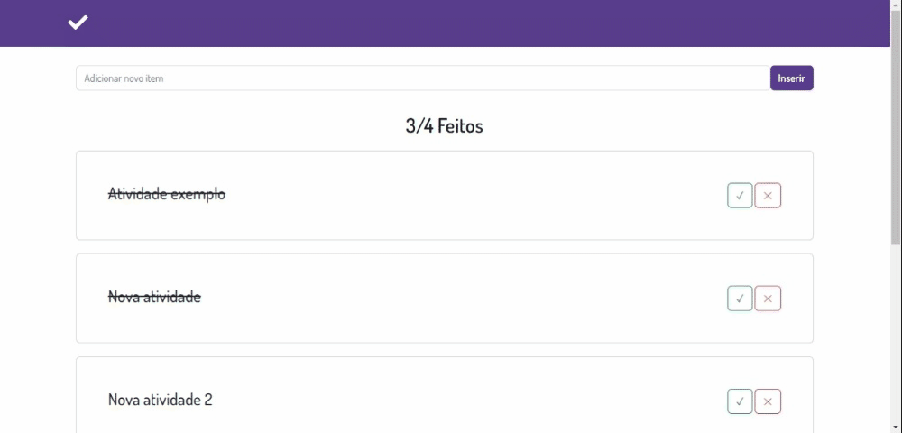

# ToDoList

<h1>
    <a href="https://to-do-list-edpadua.vercel.app/"></a>
</h1>

# Summary

- [About](#about)
- [Demo](#-demo)
- [Technologies](#technologies)
- [Setup](#setup)
- [License](#license)
- [Contact](#contact)
 
## About

This project is an implementation using the ToDoList react library, an application that lists activities to be performed and marks those that have already been done. The user types the name of the activity through the text input field, insert it in the list with the insert button, to mark an activity as done, just check the check button in each one of them. In addition to showing the list of activities, this version of ToDoList also shows how many of the activities in the list are completed.

In this project, the Bootstrap library was used, which already offers some ready-made components.

### :desktop_computer: Desktop design


### :iphone: Tablets design


### [🌐 Demo](to-do-list-edpadua.vercel.app)

### Technologies

- [ReactJS](https://reactjs.org)
- [Vite](https://vitejs.dev/guide/)
- [Bootstrap](https://react-bootstrap.github.io/)
- [React Icons](https://react-icons.github.io/react-icons/)

## Setup

```bash
git clone https://github.com/edpadua/ToDoList

cd todolist
npm i
npm run dev
```


## License

Distributed under the MIT License. See `LICENSE.txt` for more information.


## Contact

Eduardo de Pádua: ed.padua@gmail.com

Project Link: [https://github.com/edpadua/ToDoList/](https://github.com/edpadua/ToDoList) 

 
